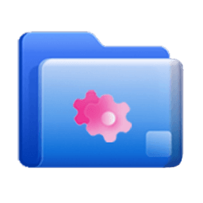

# 👋 Hi there, fellow <𝚍𝚎𝚟𝚎𝚕𝚘𝚙𝚎𝚛𝚜 />, I'm [Dyno](https://dynonguyen.com)

## 🧑‍💻 About me

- 🧑‍💻 I'm a Software Engineer. I’m currently working with JS, TS, Go, React, React Native, Vue, NextJS, NestJS, etc.
- 🎸 Fun fact: Open-minded and friendly, I enjoy sharing knowledge with others. I love playing guitar and coding.
- 📚 I'm a lifelong learner.
- ☕ I need more coffee.
- 📫 Contact me: [tuannguyentn2504@gmail.com](mailto:tuannguyentn2504@gmail.com)
- 🍀 My blog: [dynonguyen.com](https://dynonguyen.com)

## 🛠️ Technologies & Tools

<!-- https://shields.io/badges -->
<!-- https://simpleicons.org/ -->

#### Programming languages

&nbsp;
&nbsp;

#### Front-end

&nbsp;
&nbsp;
&nbsp;
&nbsp;
&nbsp;
&nbsp;

&nbsp;
&nbsp;
&nbsp;

#### Back-end

&nbsp;
&nbsp;
&nbsp;
&nbsp;
&nbsp;
&nbsp;
&nbsp;
&nbsp;
&nbsp;
&nbsp;
&nbsp;
&nbsp;
&nbsp;
&nbsp;

#### Bundlers, Compilers & Other tools

&nbsp;
&nbsp;

#### Things I use to get stuff done

&nbsp;
&nbsp;
&nbsp;
&nbsp;
&nbsp;
&nbsp;
&nbsp;
&nbsp;
&nbsp;
&nbsp;
&nbsp;

## 🚀 Things I've shipped

&nbsp;&nbsp;&nbsp;&nbsp;

&nbsp;&nbsp;&nbsp;&nbsp;

 
 

&nbsp;&nbsp;&nbsp;&nbsp;

&nbsp;&nbsp;&nbsp;&nbsp;

## ✨ GitHub Stats

## ☕ Buy me a coffee

---

Last edited: 2025-08-09
